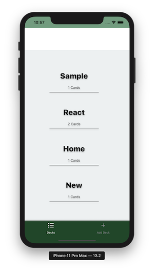
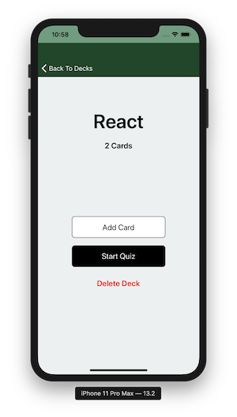
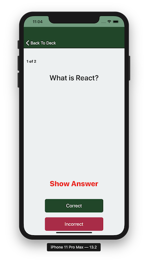
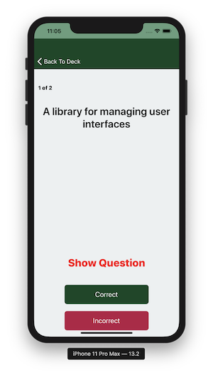
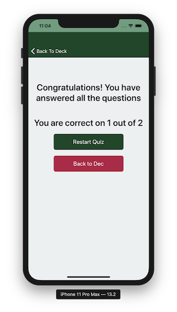
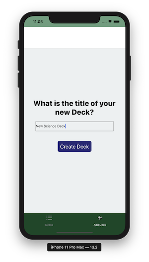
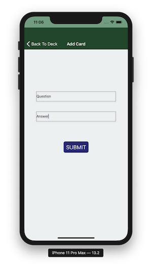
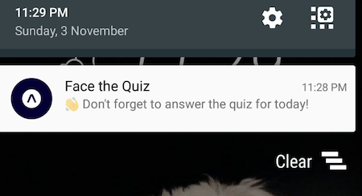

# Mobile Flashcard app
In this mobile app allows users to study collections of flashcards. 
The app will allow users to create different categories of flashcards called "decks", 
add flashcards to those decks, then take quizzes on those deck.

This application has been tested on __IOS emulator__ and **Android version 6.0** on a mobile.

## Quick start

To run the application:
* clone the project from the git location `https://github.com/vijithaepa/FlashCard.git`
* navigate in to the folder and install all project dependencies with `npm install` or `yarn install`
* start the development server with `npm start` or `yarn start`
* start the IOS simulator (tested on iPhone 11 Pro Max). Or alternatively, can be install and run the application in `android 6.01` mobile phone by scanning the QR code. 
More details to setup IOS simulator can be found [here](https://developer.apple.com/library/archive/documentation/IDEs/Conceptual/iOS_Simulator_Guide/GettingStartedwithiOSSimulator/GettingStartedwithiOSSimulator.html)
and [here](http://www.macinstruct.com/node/494)

## App Functionality
 **Basic functionality is noted down below in details**
- Deck List View (Default View)
	- Displays the title of each Deck
	- Displays the number of cards in each deck
	
    

- Individual Deck View
	- displays the title of the Deck
	- displays the number of cards in the deck
	- displays an option to start a quiz on this specific deck
	- An option to add a new question to the deck
	- An option to delete the deck
	
	

- Quiz View
	- Displays a card question
	- An option to view the answer (flips the card)
	- A "Correct" button
	- An "Incorrect" button
	- The number of cards left in the quiz
	- Displays the percentage correct once the quiz is complete
	
	
    
	

- New Deck View
	- An option to enter in the title for the new deck
	- An option to submit the new deck title
	
    

- New Question View
	- An option to enter in the question
	- An option to enter in the answer
	- An option to submit the new question
	
	

- Users receives a notification at 6.00PM to remind themselves to study if they haven't already for that day.

    
